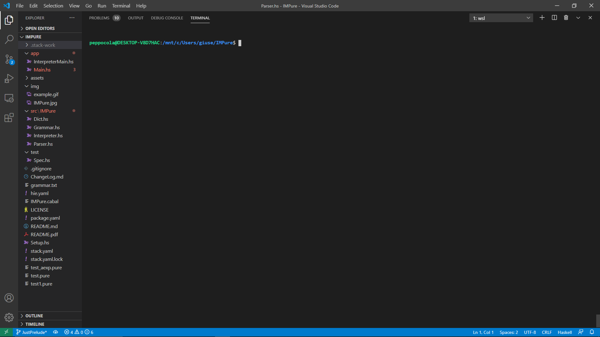
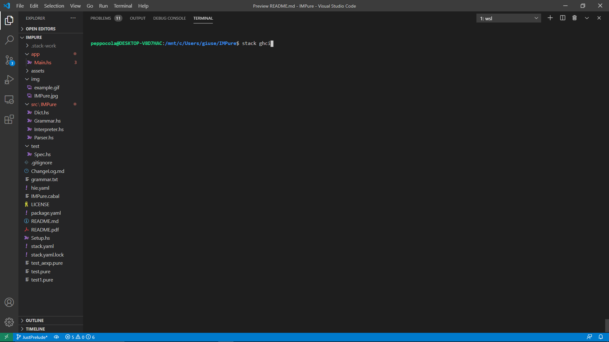
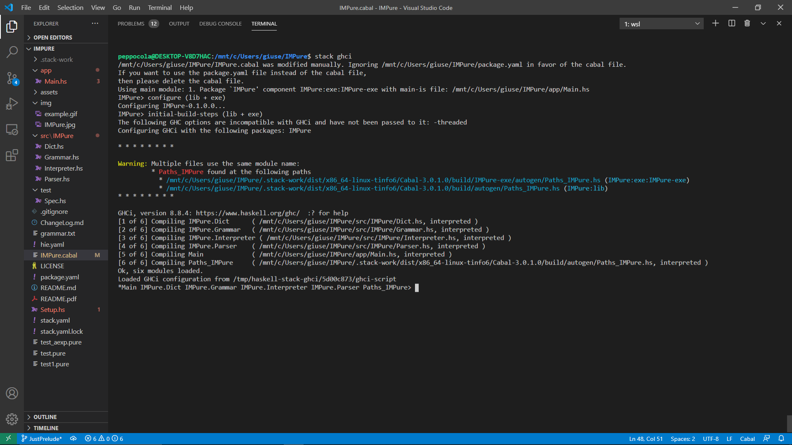
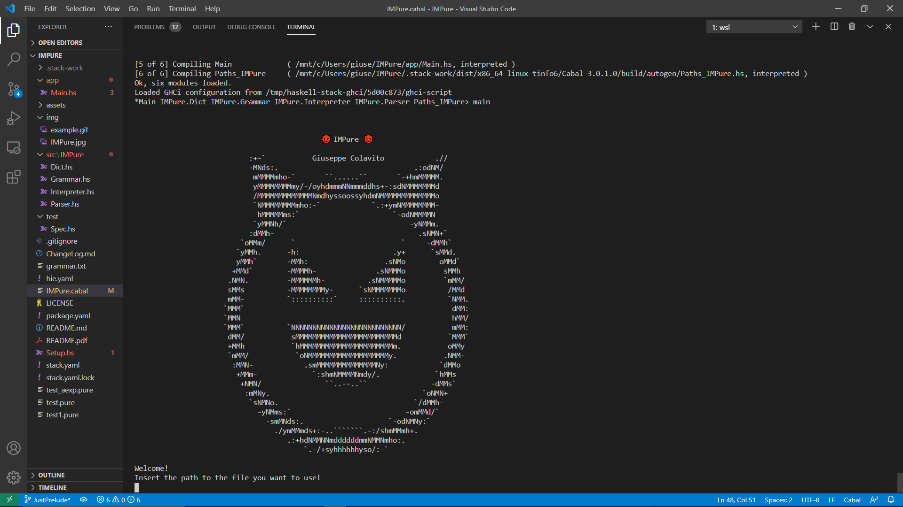
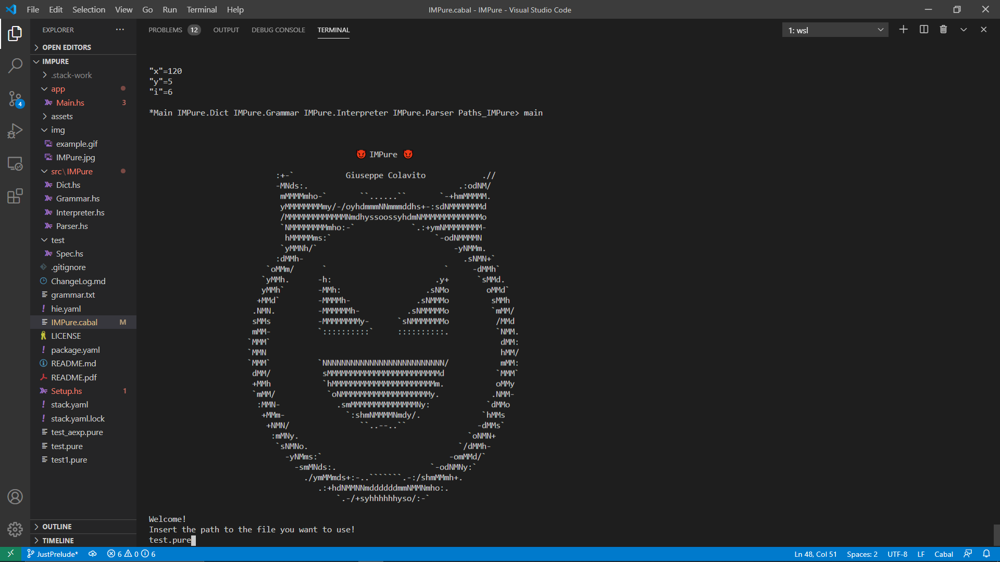
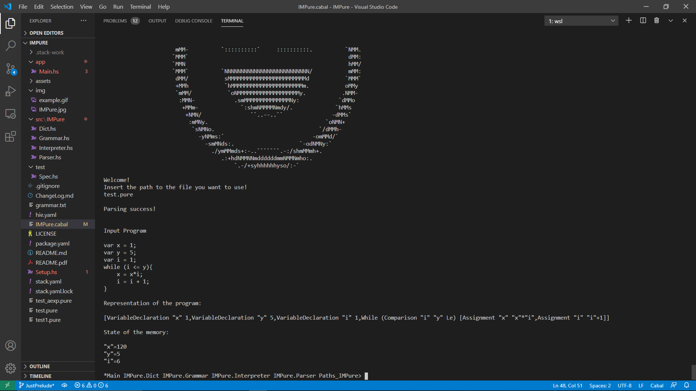
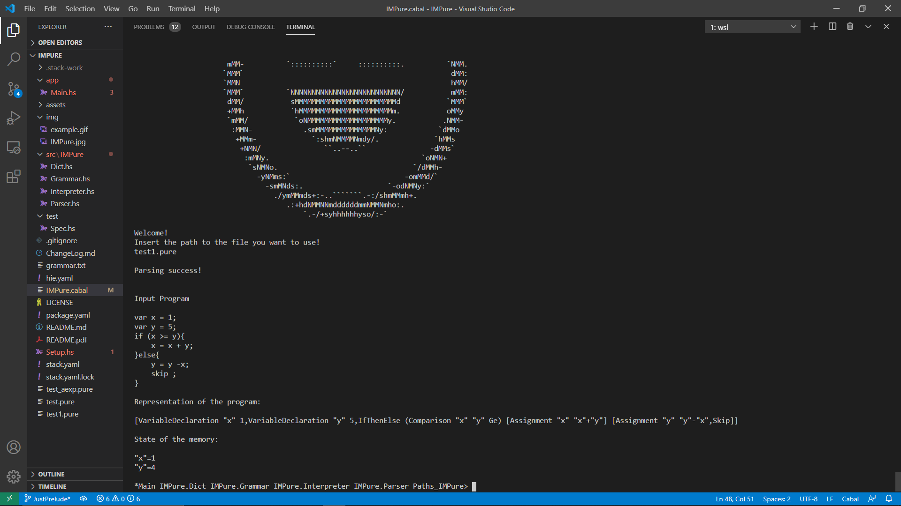

<p align="center" width="100%">

</p>

# 😈IMPure😈
A simple interpreter for the IMP language written in Haskell.
This parser-interpreter was realized for the course of "**Formal Method for Computer Science**" by Giuseppe Colavito.

IMP is a simple imperative language. It is composed by these basic structures:
<ul>
<li>Assignment : assign a value to a variable</li> 
<li>If then else : if a boolean expression is true, then some instructions are executed. If not, some other instruction are executed</li>
<li>While : loops executing the same command while a boolean condition is true</li>
<li>Skip : does nothing</li>
</ul>

The IMPure interpreter uses eager evaluation strategy. To perform this kind of execution the interpreter uses the **call-by-value**.
The IMPure language can only accept variables of type Integer. 
<br><br><br><br><br><br><br><br>
# Grammar
```EBNF
program ::=   <command> | <command> <program>

command ::=   <variableDeclaration> ";"
          |   <assignment> ";"
          |   <ifThenElse> ";"
          |   <while> ";"
          |   <skip> ";"

variableDeclaration ::= "var" <identifier> "=" <aexp> ";"

assignment ::=    <identifier> "=" <aexp> ";"

ifThenElse ::=    "if" "("<bexp>")" "{" <program> "}"
            |     "if" "("<bexp>")" "{" <program>"}" "else" "{" <program> "}"

while ::=      "while" "("<bexp>")" "{" <program> "}"

skip ::=   "skip"

aexp ::=    <aterm> | <aterm> "+" <aexp> | <aterm> "-" <aexp>

aterm ::=   <afact> | <afact> "-" <aterm>

afact ::= <positiveterm> | <negativeterm> | "(" <aexp> ")"

negativeterm ::=    "-" <positiveterm>

positiveterm ::=    <naturalnumber> | <identifier>

bexp ::=        <bterm> | <bexp> "or" <bexp> | <comparison>

bterm ::=       <bfact> "and" <bexp>

bfact ::=       <truthvalue> | "not" <bexp> | "(" <bexp> ")"

comparison ::=  <aexp> <operator> <aexp>

truthvalue ::=    "True" | "False"

operator ::=    "<" | ">" | "==" | "<=" | ">=" | "!="

naturalnumber ::=   <digit> | <digit> <integer>

digit ::=     [0-9]*
identifier ::=    [a-zA-Z_][a-zA-Z_0-9]*
```

# Design 
The IMPure interpreter is splitted in two part:
<ul>
<li>A parser</li>
<li>An intepreter</li>
</ul>

The input file is passed to the parser, who creates an internal representation of the program.
The output of the parser is then passed to the interpreter that evaluates the program and updates the state of the memory that is empty at the start of the interpretation step. When the interpreter encounters a name of variable, he goes check into the state of the memory and uses the value of the variable.

# Implementation
The environment (the state of the memory) is defined as a dictionary, where is stored the value associated with each name of variable that is declarated (and eventually updated) in the program.

```Haskell
type Env = Dict String Int
```
### Environment Management
The environment must be kept updated within the execution of the program. For this purpose, the basic operation of the dictionary are used.

```Haskell
newtype Dict key value = Dict [(key, value)]

--get the value for a given key
get :: (Eq key) => Dict key value -> key -> Maybe value
get (Dict []) _ = Nothing
get (Dict ((k, v) : ps)) key =
  if key == k then Just v else get (Dict ps) key

--insert into dictionary
insert :: (Eq key) => Dict key value -> key -> value -> Dict key value
insert (Dict []) key value = Dict [(key, value)]
insert (Dict ((k, v) : ps)) key value =
  if key == k then Dict ((key, value) : ps)
    else Dict ((k, v) : ds)
  where
    (Dict ds) = insert (Dict ps) key value
```

The interpreter operates on the internal representation of the program that is constructed from the code by the parser.

### Internal structures

The internal structures used for this purpose are similar to the grammar's non-terminals : 

```Haskell
type Program = [Command]
```
The program is represented as a list of commands.

```Haskell
data Command
  = VariableDeclaration String AExp
  | Assignment String AExp
  | IfThenElse BExp [Command] [Command]
  | While BExp [Command]
  | Skip
```

The available commands are:
<ul>
<li>Variable declaration, to declare a variable and assign to it an integer value,</li>
<li>Assignment, to assign to a previously declared variable a new value,</li>
<li>If-then-else, which executes the first list of commands if the boolean condition is true, otherwhise it executes the second list of commands, </li>
<li>While, which executes the list of commands while the boolean condition is true,</li>
<li>Skip, which goes to the next command without doing anything.</li>
</ul>

```Haskell
data AExp
  = Constant Int
  | AVariable String
  | Add AExp AExp
  | Sub AExp AExp
  | Mul AExp AExp
```
An arithmetic expression could be an integer constant, a name of variable, or an operation between two arithmetic expressions.
The available operations on arithmetic expressions are addition, subtraction and multiplication.

```Haskell
data BExp
  = Boolean Bool
  | Not BExp
  | Or BExp BExp
  | And BExp BExp
  | Comparison AExp AExp Operator

data Operator
  = Lt
  | Le
  | Gt
  | Ge
  | Eq
  | Neq
```
A boolean expression could be a boolean constant, an operation on boolean expression or a comparison between arithmetic expressions.
The available operations on boolean expressions are not, or and and.
The available comparison operators are less-then, less-equal, greater-then, greater-equal, equal, not-equal.

### Interpreter Implementation
To implement all of the constructs of the IMP language, the interpreter will have to evaluate arithmetic expressions, boolean expressions and the commands we talked about (eg. if, while, ...). 
The results of the evaluation  of the interpreter are wrapped in a *Maybe* type.
This way we can easly represent failures and use the ```error``` function to interrupt the execution of the interpreter. We can also have a string in input to better understand which was the cause of the error! Since the Functor and Applicative are already implemented for the Maybe type, we can easly unwrap the results, do some operation on them and then wrap them again and return it.

#### Arithmetic expression evaluation
The interpreter can evaluate an arithmetic expression given an environment and an *AExp* (that is defined in the internal structures). The output can be a ```Just Int``` or an ```Nothing```. This evaluation is implemented using Functor(<$>) and Applicative (<*>).

```Haskell
aexpEval :: Env -> AExp -> Maybe Int
aexpEval _ (Constant i) = Just i
aexpEval e (AVariable s) =
  case get e s of
    Just v -> Just v
    Nothing -> error "UndeclearedVariable" 
aexpEval e (Add a b) = (+) <$> aexpEval e a <*> aexpEval e b --Applicative
aexpEval e (Sub a b) = (-) <$> aexpEval e a <*> aexpEval e b
aexpEval e (Mul a b) = (*) <$> aexpEval e a <*> aexpEval e b
```

#### Boolean expression evaluation
The interpreter can evaluate a boolean expression given an environment and a *BExp* (that is defined in the internal structures). The output can be a ```Just Bool``` or an ```Nothing```. This evaluation is implemented again using Functor(```<$>```) and Applicative (```<*>```).
```Haskell
bexpEval :: Env -> BExp -> Maybe Bool
bexpEval _ (Boolean b) = Just b
bexpEval e (Not b) = not <$> bexpEval e b --Functor
bexpEval e (Or a b) = (||) <$> bexpEval e a <*> bexpEval e b --Applicative
bexpEval e (And a b) = (&&) <$> bexpEval e a <*> bexpEval e b
bexpEval e (Comparison a b op) = compEval e a b op

compEval :: Env -> AExp -> AExp -> Operator -> Maybe Bool
compEval e a b Lt = (<) <$> aexpEval e a <*> aexpEval e b
compEval e a b Le = (<=) <$> aexpEval e a <*> aexpEval e b
compEval e a b Gt = (>) <$> aexpEval e a <*> aexpEval e b
compEval e a b Ge = (>=) <$> aexpEval e a <*> aexpEval e b
compEval e a b Eq = (==) <$> aexpEval e a <*> aexpEval e b
compEval e a b Neq = (/=) <$> aexpEval e a <*> aexpEval e b
```
#### Commands Execution
Given an environment and a list of commands, we can execute the commands in the list (the program).
```Haskell
programExec :: Env -> [Command] -> Env
programExec e [] = e
programExec e (Skip : cs) = programExec e cs
programExec e ((VariableDeclaration s ex) : cs) =
  case aexpEval e ex of
    Just ex' -> case get e s of
      Just _ -> error "MultipleDeclaration"
      Nothing -> programExec (insert e s ex') cs
    Nothing -> error "InvalidArithmeticExpression"
programExec e ((Assignment s ex) : cs) =
  case get e s of
    Just _ -> programExec (insert e s ex') cs
      where
        Just ex' = aexpEval e ex
    Nothing -> error "UndeclearedVariable"
programExec e ((IfThenElse b nc nc') : cs) =
  case bexpEval e b of
    Just True -> programExec e (nc ++ cs)
    Just False -> programExec e (nc' ++ cs)
    Nothing -> error "InvalidBooleanExpression"
programExec e ((While b c) : cs) =
  case bexpEval e b of
    Just True -> programExec e (c ++ [While b c] ++ cs)
    Just False -> programExec e cs
    Nothing -> error "InvalidBooleanExpression"
```
And here is our interpreter. If we give in input a program (written as the internal representation of the program of the interpreter), the interpreter will evaluate the program and give us in output the state of the memory at the end of the program!
If something goes wrong, the execution gets interrupted and some basic information about the error are shown.

This is how a legal input for the interpreter looks like. At the end of the computation, x will be the result of the factorial of 5.

```Haskell
          [ VariableDeclaration "i" (Constant 1),
            VariableDeclaration "n" (Constant 5),
            VariableDeclaration "x" (Constant 1),
            While
              (Comparison (AVariable "i") (AVariable "n") Le)
              [ Assignment "x" (Mul (AVariable "x") (AVariable "i")),
                Assignment "i" (Add (AVariable "i") (Constant 1))
              ]
          ]
```
Of course this "language" is too hard to write and understand. For more complex programs it would be really heavy to read and write.
To avoid this problems we define a more friendly language and implement a parser that will transform the new language in the language of the interpreter.
 
### Parser Implementation
#### Parser Type
First of all we define our type Parser:
```Haskell
newtype Parser a = P (String -> Maybe (a, String))
```
The parser contains a function from string to a ```Maybe``` couple ```(a, String)```, where a is a parametrized type and the string is the part of the input string that is not parsed yet.
The type a is the type of value returned in case of correctly parsed input.
We use the ```Maybe``` just to have the value of ```Nothing``` that will mean to us that the parser failed to parse.
#### Functor, Applicative, Monad, Alternative
We want to build a chain of parsers that will parse all the code we give in input, and to do this in haskell we will need to implement some methods:

```Haskell
instance Functor Parser where
  fmap g (P p) =
    P
      ( \input -> case p input of
          Nothing -> Nothing
          Just (v, out) -> Just (g v, out)
      )
```
The Functor is usefull to apply a function to a value wrapped in a Parser.

``` Haskell
instance Applicative Parser where
  pure v = P (\input -> Just (v, input))
  (P pg) <*> px =
    P
      ( \input -> case pg input of
          Nothing -> Nothing
          Just (g, out) -> case fmap g px of
            (P p) -> p out
      )
```
The Applicative is used when we have a function wrapped in a Parser and a Parser. We want to apply the function in the first argument to the second argument of the applicative. 

``` Haskell
instance Monad Parser where
  (P p) >>= f =
    P
      ( \input -> case p input of
          Nothing -> Nothing
          Just (v, out) -> case f v of
            (P p) -> p out
      )
```
The Monad is used to apply a function that returns a wrapped parser to a wrapped parser.

```Haskell
class Applicative f => Alternative f where
  empty :: f a
  (<|>) :: f a -> f a -> f a
  many :: f a -> f [a]
  some :: f a -> f [a]
  many x = some x <|> pure []
  some x = (:) <$> x <*> many x

instance Alternative Maybe where
  empty = Nothing
  Nothing <|> my = my
  (Just x) <|> _ = Just x

instance Alternative Parser where
  empty = P (const Nothing)

  (P p) <|> (P q) =
    P
      ( \input -> case p input of
          Nothing -> q input
          Just (v, out) -> Just (v, out)
      )
```
It's useful to implement the class alternative that will allow us to concatenate more parsers and use some cool functions like many and some.
If we have two parsers P and Q, using the ```<|>```, if the first fails we will get as output the output of the second parser, else we will get the output of the first. 
<br><br><br><br><br><br><br>
#### Arithmetic Expression Parsing
```Haskell
aexp :: Parser AExp
aexp =
  do
    a <- aTerm
    do
      symbol "+"
      Add a <$> aexp
      <|> do
        symbol "-"
        Sub a <$> aexp
      <|> return a
```
```Haskell
aTerm :: Parser AExp
aTerm =
  do
    a <- aFactor
    do
      symbol "*"
      Mul a <$> aTerm
      <|> return a
```
```Haskell
aFactor :: Parser AExp
aFactor =
  (Constant <$> integer)
    <|> (AVariable <$> identifier)
    <|> do
      symbol "("
      a <- aexp
      symbol ")"
      return a
```
The aexp Parser does all the parsing on the arithmetic expressions by using aTerm that uses aFactor. This two other parser are useful to ensure the precedence on the multiplication operation but also giving the higher precedence on the expressions written between round brackets.
<br><br><br><br><br><br><br><br>
#### Boolean Expression Parsing
```Haskell
bexp :: Parser BExp
bexp =
  do
    b <- bTerm
    symbol "or"
    Or b <$> bexp
    <|> do
      comparison
```
```Haskell
bTerm :: Parser BExp
bTerm =
  do
    b <- bFact
    symbol "and"
    Or b <$> bexp
```
```Haskell
bFact :: Parser BExp
bFact =
  do
    symbol "True"
    return (Boolean True)
    <|> do
      symbol "False"
      return (Boolean False)
    <|> do
      symbol "not"
      Not <$> bexp
    <|> do
      symbol "("
      b <- bexp
      symbol ")"
      return b
```
The bexp Parser does all the parsing on the boolean expressions by using bTerm that uses bFactor. This two other parser are useful to ensure the precedence on the and operation but also giving the higher precedence on the not operation and the expressions written between round brackets. The bexp parser also uses the comparison parser, which handles all the possible comparisons between arithmetic expressions.

```Haskell
comparison :: Parser BExp
comparison =
  do
    a1 <- aexp
    do
      symbol "<"
      a2 <- aexp
      return (Comparison a1 a2 Lt)
      <|> do
        symbol "<="
        a2 <- aexp
        return (Comparison a1 a2 Le)
      <|> do
        symbol ">"
        a2 <- aexp
        return (Comparison a1 a2 Gt)
      <|> do
        symbol ">="
        a2 <- aexp
        return (Comparison a1 a2 Ge)
      <|> do
        symbol "=="
        a2 <- aexp
        return (Comparison a1 a2 Eq)
      <|> do
        symbol "!="
        a2 <- aexp
        return (Comparison a1 a2 Neq)
```

#### Commands Parsing
```Haskell
command :: Parser Command
command =
  variableDeclaration
    <|> assignment
    <|> ifThenElse
    <|> while
    <|> skip
```
The command parser is basically an or between all the parsers of the possible commands.

```Haskell
variableDeclaration :: Parser Command
variableDeclaration =
  do
    symbol "var"
    i <- identifier
    symbol "="
    r <- VariableDeclaration i <$> aexp
    symbol ";"
    return r
```
The variable declaration parser, as defined in the grammar, parses a "var" string, an identifier and an arithmetic expression to assign to it. It is not possible to declare a variable without assigning a value to it.

```Haskell
assignment :: Parser Command
assignment =
  do
    i <- identifier
    symbol "="
    r <- Assignment i <$> aexp
    symbol ";"
    return r
```
The assignment parser is like the variable declaration parser but withou the "var" string.

```Haskell
skip :: Parser Command
skip =
  do
    symbol "skip"
    symbol ";"
    return Skip
```
The skip parser is probabily the most trivial parser!

```Haskell
ifThenElse :: Parser Command
ifThenElse =
  do
    symbol "if"
    symbol "("
    b <- bexp
    symbol ")"
    symbol "{"
    thenProgram <- program
    do
      symbol "}"
      symbol "else"
      symbol "{"
      elseProgram <- program
      symbol "}"
      return (IfThenElse b thenProgram elseProgram)
      <|> do
        symbol "}"
        return (IfThenElse b thenProgram [Skip])
```
The if-then-else parser parses the "if" and the boolean expression between round brackets and saves the programs in both branches, returning the internal representation of this construct. The interpeter will then decide which branch to execute, based on the boolean expression.

```Haskell
while :: Parser Command
while =
  do
    symbol "while"
    symbol "("
    b <- bexp
    symbol ")"
    symbol "{"
    p <- program
    symbol "}"
    return (While b p)
```
The while parser parses the "while" and the boolean expression between round brackets and saves the program inside the curl braces, returning the internal representation of this construct. The interpeter will then decide how many times the program inside the while will be executed, based on the boolean condition.
<br><br><br><br><br>
#### Program Parsing
```Haskell
program :: Parser [Command]
program =
  do many command
```
The program parser parses many commands, meaning that a program can be composed of 0 or potentially infinite commands.
```Haskell
parse :: String -> ([Command], String)
parse s = (first, second)
  where
    (P p) = program
    result = p s
    first = fst (head result)
    second = snd (head result)

parseFailed :: ([Command], String) -> Bool
parseFailed (_ , "") = False
parseFailed (_ , _) = True

getParsedCommands :: ([Command], String) -> [Command]
getParsedCommands (c , _) = c

getRemainingInput :: ([Command], String) -> String
getRemainingInput (_ , s) = s
```

Here are some operation to use the parser.
The parse method parses an entire program and returns as output the list of commands written in the internal representation and the string of unconsumed output. If this string is not empty, the parsing failed!
<br><br><br><br><br><br><br><br><br><br>
# Execution Example
First, we run the shell in the folder of the project.



Then we type ghci.



Once in ghci we import all the modules.

***:l app/Main.hs src/IMPure/Dict.hs src/IMPure/Grammar.hs src/IMPure/Interpreter.hs src/IMPure/Parser.hs***

(type this all in a single line!)



Once we have imported all the modules we type ```main``` and then press Enter!



Now we should write the path to the file we want to give in input to the interpreter.
*(you can use* ```test.pure``` *and* ```test1.pure```*)*



In this example the IMPure interpreter evaluates the factorial (the code used can be found in the file **test.pure**)



In this other example the IMPure interpreter evaluates a random program with an If-then-else (the code used can be found in the file **test1.pure**)



Have fun with IMPure!!!!!!