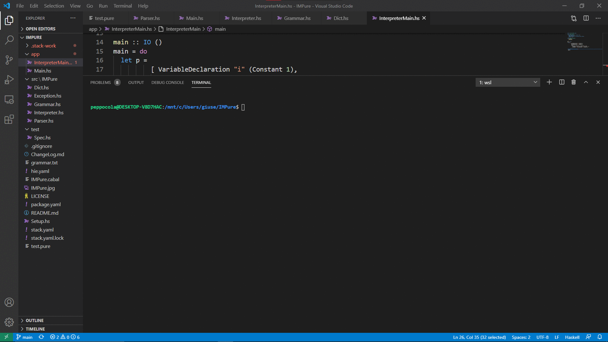

<p align="center" width="100%">

</p>

# 😈IMPure😈
A simple interpreter for the IMP language written in Haskell.
This parser-interpreter was realized for the course of "**Formal Method for Computer Science**" by Giuseppe Colavito.
IMP is a simple imperative language. It is composed by these basic structures:
<ul>
<li>Assignment : assign a value to a variable</li> 
<li>If then else : if a boolean expression is true, then some instructions are executed. If not, some other instruction are executed</li>
<li>While : loops executing the same command while a boolean condition is true</li>
<li>Skip : does nothing</li>
</ul>

The IMPure interpreter uses eager evaluation strategy.
The IMPure language can only accept variables of type Integer. To perform this kind of execution the interpreter uses the **call-by-value**.

# Grammar
Here is reported the formal grammar of the IMPure language.
```EBNF
program ::=   <command>
          |   <command> <program>

command ::=   <assignment> ";"
          |   <ifThenElse> ";"
          |   <while> ";"
          |   <skip> ";"

assignment ::=    <identifier> "=" <aexp>
            |     <identifier> "=" <bexp>

ifThenElse ::=    "if" (<bexp>) "{" <program> "}"
            |     "if" (<bexp>) "{" <program> "}" "else" "{" <program> "}"

while ::=      "while" (<bexp>) "{" <program> "}"

skip ::=   "skip"

aexp ::=    <aterm>
      |     <aterm> "+" <aexp>
      |     <aterm> "-" <aexp>
      |     <aterm> "*" <aexp>
      |     <aterm> "/" <aexp>

aterm ::=   <positiveterm>
      |     <negativeterm>

negativeterm ::=    "-" <positiveterm>

positiveterm ::=    <positivenumber>
              |     <identifier>

bexp ::=        <truthvalue>
      |         "not" <bexp>
      |         <bexp> "or" <bexp>
      |         <bexp> "and" <bexp>
      |         <aexp> <operator> <aexp>

truthvalue ::=    "True"
            |     "False"
            |     <identifier>

operator ::=    "<"
          |     ">"
          |     "=="
          |     "<="
          |     ">="
          |     "!="

integer ::=   <digit>
          |   <digit> <integer>

digit ::=     [0-9]*

identifier ::=    [a-zA-Z_][a-zA-Z_0-9]*
```

# Design 
The IMPure interpreter is splitted in two part:
<ul>
<li>A parser</li>
<li>An intepreter</li>
</ul>

The input file is passed to the parser, who creates an internal representation of the program.
The output of the parser is then passed to the interpreter that evaluates the program and updates the state of the memory that is empty at the start of the interpretation step. When the interpreter encounters a name of variable, he goes check into the state of the memory and uses the value of the variable.

# Implementation
The environment (the state of the memory) is defined as a dictionary, where is stored the value associated with each name of variable that is declarated (and eventually updated) in the program.

```Haskell
type Env = Dict String Int
```
### Environment Management
The environment must be kept updated within the execution of the program. For this purpose, the basic operation of the dictionary are used.

```Haskell
module IMPure.Dict where

newtype Dict key value = Dict [(key, value)]

instance (Show key, Show value) => Show (Dict key value) where
  show (Dict []) = ""
  show (Dict ((k, v) : ps)) = show k ++ "=" ++ show v ++ "\n" ++ show (Dict ps)

--get an empty dictionary
empty :: (Eq key) => Dict key value
empty = Dict []

--check if a dictionary is empty
isempty :: (Eq key) => Dict key value -> Bool
isempty (Dict []) = True
isempty _ = False

--get the value for a given key
get :: (Eq key) => Dict key value -> key -> Maybe value
get (Dict []) _ = Nothing
get (Dict ((k, v) : ps)) key =
  if key == k
    then Just v
    else get (Dict ps) key

--insert into dictionary
insert :: (Eq key) => Dict key value -> key -> value -> Dict key value
insert (Dict []) key value = Dict [(key, value)]
insert (Dict ((k, v) : ps)) key value =
  if key == k
    then Dict ((key, value) : ps)
    else Dict ((k, v) : ds)
  where
    (Dict ds) = insert (Dict ps) key value --unwrap ds from dictionary
```

The interpreter operates on the internal representation of the program that is constructed from the code by the parser.

### Internal structures

The internal structures used for this purpose are similar to the grammar's non-terminals : 

```Haskell
-- Grammar.hs contains the structures for the internal representation of
-- the data.
module IMPure.Grammar where

type Program = [Command]

data Command
  = VariableDeclaration String AExp
  | Assignment String AExp
  | IfThenElse BExp [Command] [Command]
  | While BExp [Command]
  | Skip

data AExp
  = Constant Int
  | AVariable String
  | Add AExp AExp
  | Sub AExp AExp
  | Mul AExp AExp

data BExp
  = Boolean Bool
  | Not BExp
  | Or BExp BExp
  | And BExp BExp
  | Comparison AExp AExp Operator

data Operator
  = Lt
  | Le
  | Gt
  | Ge
  | Eq
  | Neq
```
### Interpreter Implementation
The interpreter
#### Arithmetic expression evaluation
```Haskell
aexpEval :: Env -> AExp -> Result Int
aexpEval _ (Constant i) = Legal i
aexpEval e (AVariable s) =
  case get e s of
    Just v -> Legal v
    Nothing -> error "UndeclearedVariable"
aexpEval e (Add a b) = (+) <$> aexpEval e a <*> aexpEval e b --Applicative
aexpEval e (Sub a b) = (-) <$> aexpEval e a <*> aexpEval e b
aexpEval e (Mul a b) = (*) <$> aexpEval e a <*> aexpEval e b
```
#### Boolean expression evaluation
```Haskell
bexpEval :: Env -> BExp -> Result Bool
bexpEval _ (Boolean b) = Legal b
bexpEval e (Not b) = not <$> bexpEval e b --Functor
bexpEval e (Or a b) = (||) <$> bexpEval e a <*> bexpEval e b --Applicative
bexpEval e (And a b) = (&&) <$> bexpEval e a <*> bexpEval e b
bexpEval e (Comparison a b op) = compEval e a b op

compEval :: Env -> AExp -> AExp -> Operator -> Result Bool
compEval e a b Lt = (<) <$> aexpEval e a <*> aexpEval e b
compEval e a b Le = (<=) <$> aexpEval e a <*> aexpEval e b
compEval e a b Gt = (>) <$> aexpEval e a <*> aexpEval e b
compEval e a b Ge = (>=) <$> aexpEval e a <*> aexpEval e b
compEval e a b Eq = (==) <$> aexpEval e a <*> aexpEval e b
compEval e a b Neq = (/=) <$> aexpEval e a <*> aexpEval e b
```
#### Commands Execution
```Haskell
programExec :: Env -> [Command] -> Env
programExec e [] = e
programExec e (Skip : cs) = programExec e cs
programExec e ((VariableDeclaration s ex) : cs) =
  case aexpEval e ex of
    Legal ex' -> case get e s of
      Just _ -> error "MultipleDeclaration"
      Nothing -> programExec (insert e s ex') cs
    Error er -> error "IllegalArithmeticExpression"
programExec e ((Assignment s ex) : cs) =
  case get e s of
    Just _ -> programExec (insert e s ex') cs
      where
        Legal ex' = aexpEval e ex
    Nothing -> error "UndeclearedVariable"
programExec e ((IfThenElse b nc nc') : cs) =
  case bexpEval e b of
    Legal True -> programExec e (nc ++ cs)
    Legal False -> programExec e (nc' ++ cs)
    Error er -> error "IllegalBooleanExpression"
programExec e ((While b c) : cs) =
  case bexpEval e b of
    Legal True -> programExec e (c ++ [While b c] ++ cs)
    Legal False -> programExec e cs
    Error er -> error "IllegalBooleanExpression"
```
### Parser Implementation

# Execution Example
In this example the IMPure interpreter evaluates the factorial (the code used can be found in the file **test.pure**)
