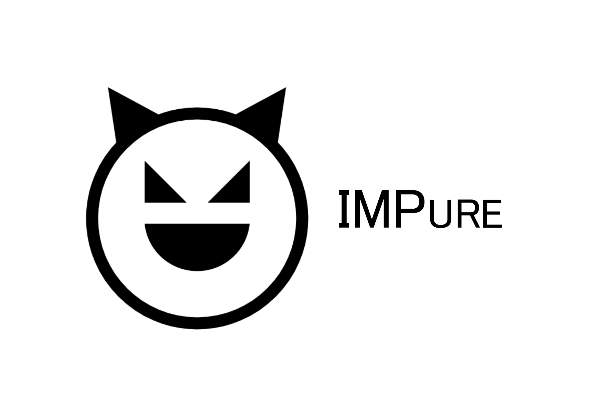

# IMPure
A simple interpreter for the IMP language written in Haskell

# Grammar
```EBNF
program ::=   <command>
          |   <command> <program>

command ::=   <assignment> ";"
          |   <ifThenElse> ";"
          |   <while> ";"
          |   <skip> ";"

assignment ::=    <identifier> "=" <aexp>
            |     <identifier> "=" <bexp>

ifThenElse ::=    "if" (<bexp>) "then" <program> "endif"
            |     "if" (<bexp>) "then" <program> "else" <program> "endif"

while ::=      "while" (<bexp>) "do" <program> "endw"

skip ::=   "skip"

aexp ::=    <aterm>
      |     <aterm> "+" <aexp>
      |     <aterm> "-" <aexp>
      |     <aterm> "*" <aexp>
      |     <aterm> "/" <aexp>

aterm ::=   <positiveterm>
      |     <negativeterm>

negativeterm ::=    "-" <positiveterm>

positiveterm ::=    <positivenumber>
              |     <identifier>

bexp ::=        <truthvalue>
      |         "not" <bexp>
      |         <bexp> "or" <bexp>
      |         <bexp> "and" <bexp>
      |         <aexp> <operator> <aexp>

truthvalue ::=    "True"
            |     "False"
            |     <identifier>

operator ::=    "<"
          |     ">"
          |     "=="
          |     "<="
          |     ">="
          |     "!="

integer ::=   <digit>
          |   <digit> <integer>

digit ::=     [0-9]*

identifier ::=    [a-zA-Z_][a-zA-Z_0-9]*
```
